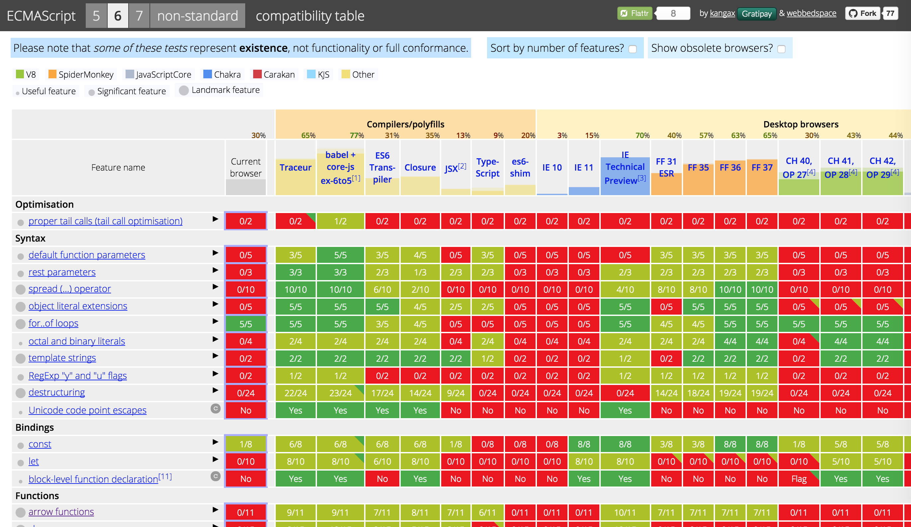

footer: Pawel Szymczykowski / @makenai
slidenumbers: true

# [fit] New ES6 Hotness

---

# [fit] ES6 = ECMAScript 6

ECMAScript 6 is the 6th edition of ECMA-262, the standard defining the behaviors of the JavaScript language.

---

> ECMAScript was always an unwanted trade name that sounds like a skin disease.
-- Brendan Eich

---

# ECMA = European Computer Manufacturers Association[^1]
They are a standards organization, like ISO.

[^1]: (but that doesn't matter)

---

# [fit] Exciting new features

---

# ECMAScript Editions

* 1 - June 1997
* 2 - June 1998
* 3 - December 1999
* 4 - *Oops...*
* 5 - December 2009
* 6 - Mid-2015
* 7 - TBA


---

# Fat Arrows

```javascript
var cat = name => console.log("my cat is named " + name);
cat('spot');
```

same as

```javascript
var cat = function (name) {
  return console.log("my cat is named " + name);
};
cat("spot");
```

---
# More On Fat Arrows

```javascript
var numbers = [ 5, 4, 3, 2, 1];

var song = numbers.map( n => n + " bottles of beer on the wall" );

console.log( song );

/*
[ '5 bottles of beer on the wall',
  '4 bottles of beer on the wall',
  '3 bottles of beer on the wall',
  '2 bottles of beer on the wall',
  '1 bottles of beer on the wall' ]
*/

```

---

# Classes

```javascript
class FarmAnimal {
  constructor() {
    this.legs = 4
  }
}

class Cow extends FarmAnimal {
  speak() {
    console.log("moo. I have " + this.legs + " legs.")
  }
}

var c = new Cow();
c.speak(); // moo. I have 4 legs.
```

---

# Fancy String Interpolation

```javascript
var legs = 7; // mutant cow
console.log(`I have ${legs} legs.`); // I have 7 legs
```

Note the back-ticks (`) which are not the same as (') or (").

---

# Enhanced Objects {}

```javascript
var a = 'apple';
var b = 'banana';

var fruit = { a, b, c: 'cherry' };

console.log( fruit ); // { a: 'apple', b: 'banana', c: 'cherry' }
```

---

# Default Params

```javascript
function speak(phrase="Um") {
  console.log(phrase);
}
```

is nicer than the es5 equivalent

```javascript
function speak(phrase) {
  phrase = phrase || "Um";
  console.log(phrase);
}

speak(); // Um
```

---

# Destructuring

```javascript
var a = "a";
var b = "b";

[a,b] = [b,a];

console.log(a); // b
```
---

# Spread Operator + for..of loops

```javascript
function makeWords(word, ...suffixes) {
  for (var suffix of suffixes) {
    console.log( word + suffix );
  }
}

makeWords('bake', 'ry', 'r', 'd');
/*
bakery
baker
baked
*/
```

---

# let and variable scope

flagpole scope

```
{
  var cat = 'meow';
}
console.log(cat); // meow
```

block scope

```
{
  let dog = 'woof';
}
console.log(dog); // ReferenceError: dog is not defined
```

---

# Modules

lib/egyptianMath.js

```javascript
export var pi = 22/7;
export function cubitsToFeet(cb) {
  return cb * 1.5;
}
```

someFile.js

```javascript
import {pi} from 'lib/egyptianMath'
console.log(pi);
```

otherFile.js

```javascript
import * as eMath from 'lib/egyptianMath'
console.log(eMath.pi);
```

---

# Sets

```javascript
var s = new Set();

s.add("OMG")
s.add("!")
s.add("ZOMG")
s.add("!")
s.add("!")
s.add("!")

console.log(s.size); // 3
```

---

# Proxies [^2]

```javascript
var pets = [ 'cat', 'dog', 'fish', 'elephant' ];

console.log( pets[-1] ); // undefined

var superPets = new Proxy(pets, {
  get: function(object, index) {
    if (Number(index) < 0) {
      return object[ object.length + Number(index) ];
    } else {
      return object[ index ];
    }
  }
});

console.log( superPets[-1] ); // "elephant"

```

[^2]: Not supported by transpilers

---

# Generators

```javascript
function *fibonacci() {
        var a=1, b=1;
        while (true) {
                [a,b] = [b,a+b];
                yield b;
        }
}

var fib = fibonacci();

console.log( fib.next() ); // { value: 2, done: false }
console.log( fib.next() ); // { value: 3, done: false }
console.log( fib.next() ); // { value: 5, done: false }
console.log( fib.next() ); // { value: 8, done: false }
console.log( fib.next() ); // { value: 13, done: false }
```

---

# Promises

```javascript
var promise = new Promise(function(resolve,reject) {
  setTimeout(function() {
    if ( Math.random() > 0.5 ) {
      resolve('alive');
    } else {
      reject('dead');
    }
  }, 500);
});

promise.then(
  function(value) {
    console.log('Yay, the cat is ' + value);
  },
  function(error) {
    console.log('Sorry, the cat is ' + error);
  }
);

```


---

# [fit] How do I use this stuff?

---



## http://kangax.github.io/compat-table/es6/

---

# [fit] IE Technical Preview
# [fit] 70% supported[^3]

[^3]: Have to enable experimental web features.

---

# [fit] FireFox 37
# [fit] 65% supported

---

# [fit] io.js
# [fit] 42% supported[^4]

[^4]: With --es_staging flag

---

# [fit] Babel
# [fit] 77% Support

---

# Babel

Compiles ES6 code into ES3 code that your JS engine can run today.

```bash
$ cat interpolation.js
```

```javascript
var legs = 7;
console.log(`I have ${legs} legs.`);
```

```bash
$ babel interpolation.js
```

```javascript
"use strict";

var legs = 7;
console.log("I have " + legs + " legs.");
```

---

# Using Babel

```bash
npm install --g babel
```

enables

```bash
babel someFile.js # Outputs the generated ES3 code
```

```bash
babel-node someFile.js # Just like the node REPL
```

---

# Grunt

```javascript
require("load-grunt-tasks")(grunt); // npm install --save-dev load-grunt-tasks

grunt.initConfig({
  "babel": {
    options: {
      sourceMap: true
    },
    dist: {
      files: {
        "dist/app.js": "src/app.js"
      }
    }
  }
});
```

---

# Babel as a library

main.js

```javascript
require('babel/register');
var myApp = require('app');

// No ES6 code allowed in this file yet
myApp.run();
```

app.js

```javascript
// ES6 code OK in this file and any else that it includes
module.exports = {
    run: function() {
      var numbers = [ 5, 4, 3, 2, 1];
      var song = numbers.map( n => n + " bottles of beer on the wall" );
      console.log( song );
    }
}

```

---

# In the browser

Probably not a great idea, but you could you know...

```html
<script src="node_modules/babel/browser.js"></script>
<script type="text/babel">
class Test {
  test() {
    return "test";
  }
}

var test = new Test;
test.test(); // "test"
</script>
```

---

# ...and a bunch of other places.

* rails
* broccoli
* browserify
* brunch
* duo
* gobble
* gulp
* make
* webpack

---

# Resources

ECMAScript 6 compatibility table
[http://kangax.github.io/compat-table/es6/](http://kangax.github.io/compat-table/es6/)

ECMAScript 2015 Language Specification
[https://people.mozilla.org/~jorendorff/es6-draft.html](https://people.mozilla.org/~jorendorff/es6-draft.html)

Overview of ECMAScript 6 features
[https://github.com/lukehoban/es6features](https://github.com/lukehoban/es6features)

---

# [fit] Questions?
